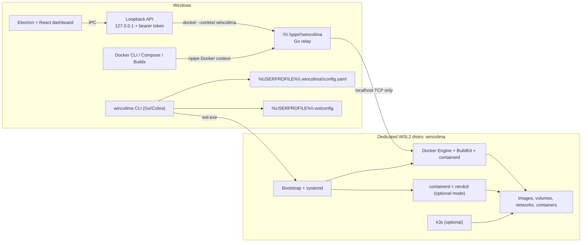

# Architecture

WinColima uses Windows only for the user experience, control plane, Docker named pipe, and installation. Linux container workloads always execute in a dedicated WSL2 distribution named `wincolima`.

## Runtime flows

`wincolima start` validates and persists the selected profile, writes only `memory` and `processors` to `.wslconfig`, ensures WSL2 and the managed distro exist, bootstraps only when the runtime marker is absent or changed, then starts Docker. Docker listens on its Unix socket and on `127.0.0.1:2375` *inside WSL*. A Windows process relays the Docker HTTP stream to `\\.\pipe\wincolima`, which is the endpoint configured in the `wincolima` Docker context.

Docker Engine is the default because it is the only mode that can transparently serve Docker CLI, Compose, Buildx, and Docker API workflows. The `containerd` mode is deliberately exposed as `nerdctl`, avoiding a misleading claim that a raw containerd socket is Docker-compatible.

## Performance approach

- The WSL distro is stopped when the runtime stops, releasing its memory.
- Startup does not re-run package installation after the initial bootstrap or runtime switch.
- Docker uses BuildKit and `local` log files by default.
- Bind mounts use WSL's `/mnt/c` path for convenience. For high-churn source trees, keep the worktree inside the Linux distribution; the next production milestone adds Mutagen-based selective sync.

## Trust boundaries

- The Docker daemon TCP listener is loopback-only; no LAN port 2375 listener is enabled.
- The desktop API binds only to `127.0.0.1` and requires a fresh 256-bit bearer token generated per desktop session.
- Electron enables context isolation, disables Node integration, and offers a narrow preload bridge.
- Credentials remain in the Docker CLI credential helper / Windows Credential Manager. The control plane never reads registry passwords.
- Rootless Docker packages are installed, but rootless Engine activation remains an opt-in production policy because WSL mount and port behavior needs per-enterprise validation.
